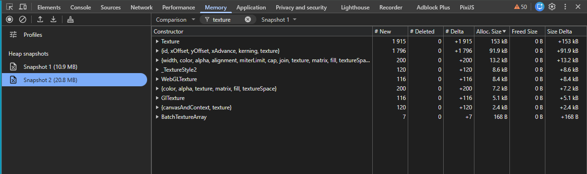

# A minimum sample, which demonstrates memory leak in pixi 8  

link to the pixi issue: https://github.com/pixijs/pixijs/issues/11751  

Steps to reproduce
1. clone the project, then execute `npm i`  
2. start the project `npm run dev`  
3. take a heap snapshot (chrome memory tab -> take heap snapshot button)  
4. click the bunny sprite - this will add 100 text objects to a container   
5. click on the container (any text) in order to destroy the texts  
6. take a heap snapshot, and compare it to snapshot #1 (change 'summary' dropdown to 'Comparison')
7. at the filter by class input type 'Texture' - you will see delta +1915 textures, which are not freed  

Pixi versions test results:  
8.14.1 - a lot bmfont textures leak  
8.14.0 - a lot bmfont textures leak  
8.13.2 - a lot bmfont textures leak  
8.13.1 - a lot bmfont textures leak  
8.13.0 - a lot bmfont textures leak  
8.12.0 - 1 bmfont textures leak, text object leak - here is the BitmapFont (*.fnt *.xml) breaking change  
8.11.0 - 1 bmfont textures leak, text object leak  
8.10.2 - 0 bmfont textures leak, text object leak  
8.10.1 - 0 bmfont textures leak, text object leak  
8.10.0 - 0 bmfont textures leak, text object leak  
8.9.2 -  0 bmfont textures leak, graphics object leak  

